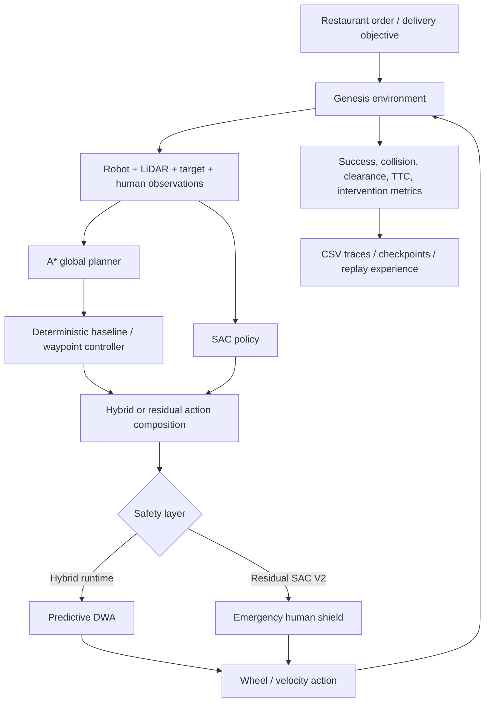

# Autonomous RL Restaurant Delivery Robot

[](https://github.com/mishal913/Autonomous-RL-restaurant-delivery-Robot/actions/workflows/ci.yml)


A simulation project for an autonomous restaurant/service delivery robot that combines **Soft Actor-Critic reinforcement learning, A* global path planning, local safety control, dynamic-human avoidance, order handling, URDF assets, and recovery logic** in the Genesis robotics simulator.

## Recruiter quick scan

| Area | Implementation |
|---|---|
| Reinforcement learning | Stable-Baselines3 Soft Actor-Critic (SAC) |
| Global navigation | A* grid/path planning |
| Local navigation | waypoint steering + static-obstacle braking |
| Dynamic-human safety | Predictive DWA in the hybrid runtime; emergency-stop shield in Residual SAC V2 |
| Residual RL | SAC learns bounded corrections on top of a deterministic navigation baseline |
| Simulation | Genesis physics/simulation environment |
| Robot/environment assets | custom URDF robot, tables, gates, pads, pedestrians, barriers and parcels |
| Restaurant logic | queued orders, pickup → table delivery missions, 8 numbered tables |
| Evaluation | randomized seeded episodes, collision/success/clearance/intervention metrics |
| Experiment logging | episode traces, replay buffers, checkpoints and TensorBoard logs |

## Repository layout

```text
.
├── robot/
│   ├── delivery_env_final_dual_delivery_v4_camera.py
│   ├── final_dual_delivery_robot_v5_deadlock_recovery.py
│   ├── final_dual_delivery_robot_v6_clean_exit.py
│   ├── final_dual_delivery_robot_v7_goal_aware_recovery.py
│   ├── *.urdf
│   └── training / experience artifacts
│
├── restaurant/
│   ├── restaurant_env_final.py
│   ├── run_final_restaurant.py
│   ├── predictive_dwa.py
│   ├── order_system.py
│   ├── restaurant_overlay.py
│   ├── baseline_controller*.py
│   ├── residual_env*.py
│   ├── residual_policy_v2.py
│   ├── train_residual_sac*.py
│   ├── evaluate_residual_sac*.py
│   ├── run_residual_sac_v2.py
│   ├── *.urdf
│   └── evaluation / training artifacts
│
├── artifacts_manifest.csv
├── requirements.txt
└── .github/workflows/ci.yml
```

## System architecture



## Two related development tracks

### 1. Dual-delivery robot

The `robot/` project evolved a SAC delivery agent toward more reliable autonomous execution with:

- randomized obstacle layouts
- A* global route guidance
- SAC low-level action proposals
- waypoint steering correction
- deadlock detection and escape-direction locking
- reverse/turn/commit recovery behavior
- goal-aware recovery
- persistent replay-buffer experience
- custom URDF scene assets
- camera-enabled environment logic

The final scripts preserve multiple development versions so the progression from deadlock recovery to cleaner exit handling and goal-aware recovery is visible.

### 2. Restaurant delivery robot

The `restaurant/` project models a restaurant with numbered tables, dynamic people, orders and pickup/delivery missions.

The main hybrid runtime uses:

```text
A* route planning
      +
SAC action proposal
      +
deterministic waypoint/furniture controller
      +
Predictive DWA dynamic-human safety filtering
      ↓
final robot action
```

The repository also includes two residual-RL experiments.

**Residual SAC V1** learns a bounded correction while the Predictive DWA safety layer remains active.

**Residual SAC V2** changes the responsibility split:

```text
A* + deterministic baseline
          ↓
Residual SAC V2
(normal moving-human avoidance)
          ↓
EmergencyHumanShield
(last-resort imminent-collision stop)
          ↓
Genesis robot
```

Predictive DWA is intentionally removed from normal V2 control so the learned residual policy must take primary responsibility for dynamic-human avoidance.

## Restaurant observation / safety design

The project progressively adds richer human information to the learned controller, including robot-relative person position and velocity features.

This addresses an important robotics/RL problem: a range-only LiDAR observation can show that an obstacle exists without telling the policy whether the obstacle is furniture or a moving person.

The safety experiments therefore separate:

- static furniture navigation
- human-relative features
- dynamic-risk prediction
- learned residual control
- emergency collision prevention

## Included evaluation artifacts

The uploaded project contains two evaluation summaries:

| Experiment | Episodes | Success | Dynamic collisions | Static collisions |
|---|---:|---:|---:|---:|
| Hybrid / residual V1 evaluation | 200 | 29% | 11% | 33.5% |
| Residual SAC V2 evaluation | 100 | 17% | 1% | 66% |

These are **experimental results, not claimed production performance**. In particular, Residual SAC V2 substantially reduced dynamic-human collisions in the recorded evaluation while still showing poor task completion/static-navigation performance. That trade-off is useful evidence for the next iteration rather than something hidden from the project.

The project documentation defines proposed graduation targets for the V2 controller of >=80% success, <=5% dynamic collisions and <=5% emergency-shield intervention rate. Those are targets, not achieved results.

## Install

A typical environment requires:

```bash
python -m pip install -r requirements.txt
```

Core dependencies are:

- `genesis-world[render]`
- `stable-baselines3`
- `gymnasium`
- `numpy`

A GPU is useful for training but the live/evaluation scripts can be configured to use CPU where supported.

## Run the restaurant hybrid runtime

From the repository root:

```bash
cd restaurant
python run_final_restaurant.py --model dynamic_sac_v3.zip
```

Useful options include:

```bash
python run_final_restaurant.py \
    --model dynamic_sac_v3.zip \
    --people 4 \
    --human-cooperation 0.35
```

## Residual SAC V2

Train:

```bash
cd restaurant
python train_residual_sac_v2.py --total-timesteps 500000
```

Evaluate:

```bash
python evaluate_residual_sac_v2.py \
    --model dynamic_sac_residual_v2.zip \
    --episodes 200
```

Run live:

```bash
python run_residual_sac_v2.py --model dynamic_sac_residual_v2.zip
```

## Run the dual-delivery robot

```bash
cd robot
python final_dual_delivery_robot_v7_goal_aware_recovery.py
```

The supplied Windows `.bat` files reflect the original development environment. Running the Python entry points directly from an activated environment is more portable.

## Large training artifacts

The original project archive also contains approximately **204 MB of binary training artifacts**, including:

- SAC checkpoints
- replay buffers
- per-episode NumPy archives
- TensorBoard event files
- smoke-test archives

Their exact paths, byte sizes and SHA-256 hashes are recorded in `artifacts_manifest.csv`.

These file patterns are configured for **Git LFS** in `.gitattributes`, which is preferable to storing large ML binaries as normal Git blobs.

## Engineering lessons demonstrated

This project is intentionally more than a single trained policy. It explores the interaction between:

- model-free continuous-control RL
- deterministic planning
- local collision avoidance
- safety shields
- reward shaping
- curriculum learning
- observation design
- human-aware navigation
- reproducible evaluation

The included intermediate versions and evaluation files make the engineering trade-offs visible instead of presenting only the final controller.
